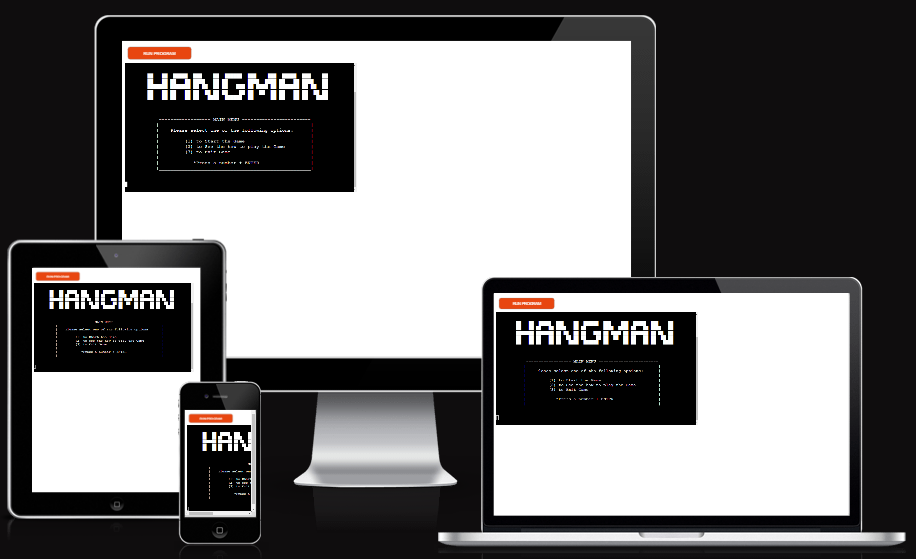

# **The Hangman game!**

[View live link](https://p3hangman-9bacfa10b6a1.herokuapp.com/)

## **Contents**
* [**Scope**](#scope)  
* [**User Experience UX**](#user-experience-ux)
    * [**User Stories**](#user-stories)
    * [**Site Owner Goals**](#site-owner-goals)
* [**Program Logic Plan**](#user-experience-ux)
* [**Technologies**](#technologies)
* [**Features**](#features)
* [**Version Control**](#version-control)    
* [**Testing**](#testing)
* [**Deployment**](#deployment)    
* [**Credits**](#credits)  
  

## **Scope**

This is a Python3 console game, deployed on Heroku.
The game goal is to guess the ramdom hidden words, letter by letter before running out of chances. The number of correct and incorrect guesses will determine if user win or lose the game. 
It offers an interactive and immersive experience where user is able to choose difficulty level while testing their vocabulary skills

[Back to contents](#contents)

## **User Experience UX**

### **User Stories**

- As a First Time User
    - I want to add my name before starting the game.
    - I want to find instructions on how to play the game. 
    - I want to get a wide range of random word selection.
    - I want to see a visual feedback when a wrong guess is made.

-  As a user returning to the site:
   - I want to be able to choose the game difficulty by myself.

[Back to contents](#contents)

## **Program Logic Plan**  

### **Flow Chart**

[Back to contents](#contents)

## **Technologies**  

## Technologies Used

- The application was built in Python. This project used the CI python template which already has HTML, CSS and JavaScript developed.

### **Frameworks & Tools**
- [Git](https://git-scm.com/)
  - Git was used for version control (commit to Git and push to GitHub).
- [GitHub](https://github.com/)
  - Used to store, host and deploy the project files and source code after being pushed from Git.
- [Gitpod](https://www.gitpod.io/)
  - An online IDE linked to the GitHub repository used to write my code.
- [Heroku](https://www.heroku.com/platform) 
  - Heroku is a cloud plataform which was used for application deployment.
- [Google sheets](https://www.google.com/sheets/about/) 
  - Used to store words for the game.
- [Lucid](https://lucid.co/) 
  - Used to create game logic/flowchart.
- [PEP8CI Validator](https://pep8ci.herokuapp.com/#) 
  - Used for error and issues with the code

[Back to contents](#contents)