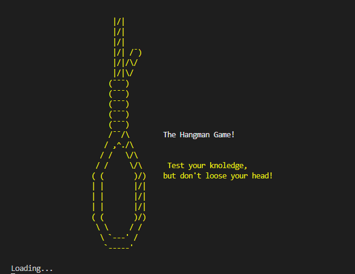
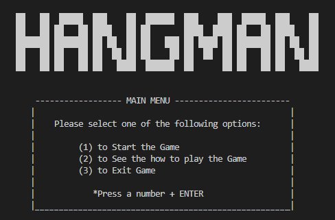
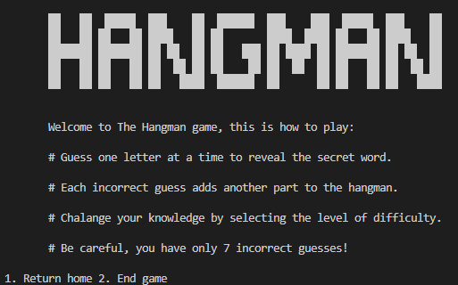
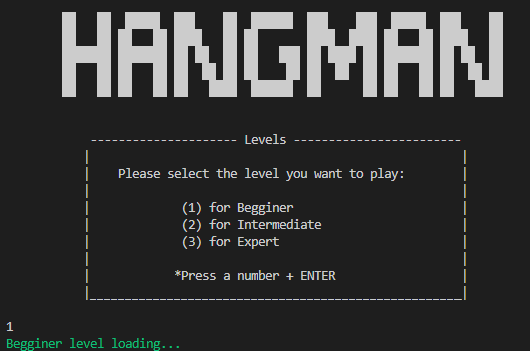
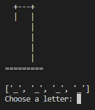
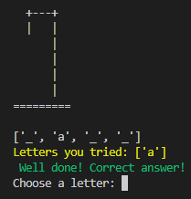
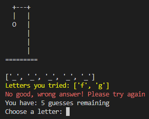
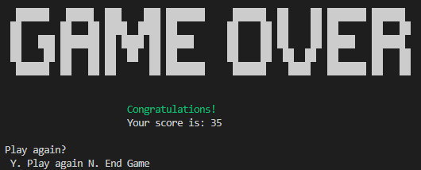
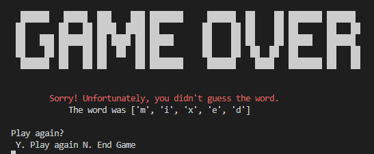
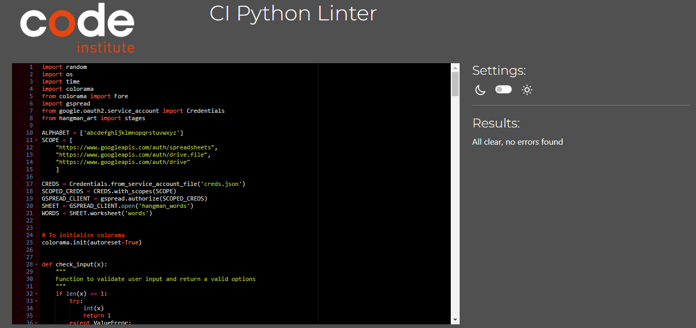

# **The Hangman game!**

[View live link](https://p3hangman-9bacfa10b6a1.herokuapp.com/)

## **Contents**
* [**Scope**](#scope)  
* [**User Experience UX**](#user-experience-ux)
    * [**User Stories**](#user-stories)
    * [**Site Owner Goals**](#site-owner-goals)
* [**Program Logic Plan**](#user-experience-ux)
* [**Technologies**](#technologies)
* [**Features**](#features)
* [**Version Control**](#version-control)    
* [**Testing**](#testing)
* [**Deployment**](#deployment)    
* [**Credits**](#credits)  
  

## **Scope**

This is a Python3 console game, deployed on Heroku.
The game goal is to guess the ramdom hidden words, letter by letter before running out of chances. The number of correct and incorrect guesses will determine if user win or lose the game. 
It offers an interactive and immersive experience where user is able to choose difficulty level while testing their vocabulary skills

[Back to contents](#contents)

## **User Experience UX**

### **User Stories**

- As a First Time User
    - I want to easy navigate and interact with the game.
    - I want to find instructions on how to play the game. 
    - I want to get a wide range of random word selection.
    - I want to see a visual feedback when a wrong guess is made.

-  As a user returning to the site:
   - I want to be able to choose the game difficulty by myself.

[Back to contents](#contents)

## **Program Logic Plan**  

### **Flow Chart**

[Back to contents](#contents)

## **Technologies**  

## Technologies Used

- The application was built in Python. This project used the CI python template which already has HTML, CSS and JavaScript developed.

### **Frameworks & Tools**
- [Git](https://git-scm.com/)
  - Git was used for version control (commit to Git and push to GitHub).
- [GitHub](https://github.com/)
  - Used to store, host and deploy the project files and source code after being pushed from Git.
- [Gitpod](https://www.gitpod.io/)
  - An online IDE linked to the GitHub repository used to write my code.
- [Heroku](https://www.heroku.com/platform) 
  - Heroku is a cloud plataform which was used for application deployment.
- [Google sheets](https://www.google.com/sheets/about/) 
  - Used to store words for the game.
- [Lucid](https://lucid.co/) 
  - Used to create game logic/flowchart.
- [PEP8CI Validator](https://pep8ci.herokuapp.com/#) 
  - Used for error and issues with the code

[Back to contents](#contents)

## **Features**

### **Features Implemented**

- Game intro
    - Greetings and short message to estimulate user to challenge themselves with moderation.

    - 
  
- Main Menu
    - The main menu gives the user clear options to select and navigate through it.

    - 
  
- How to play
    - Brief introduction in how to play the the game making user experience more effective in order to use the system.

    - 
  
- Level Menu
    - This page allows the user to pick from three different difficulty levels, each of which accesses a different list of words for the user to guess. Once level selected, terminal will print a coulored message according to the level selected.

    - 

- Main Game - Start
    - This page is where the game loop starts and it display the array for the hidden word and the hangman picture on stage 0.

    - 

- Main Game - Correct answer
    - once user input a correct letter, this will be added to the hidden word array and also to the letters already guessed. A feedback message will be displayed in green.

    - 

- Main Game - incorrect answer
    - once user input a incorrect letter, hangman starts moving stages and this letter will also be added to the letters already guessed. A feedback message will be displayed in red.

    - 

- Game Over
    - Usar may win if reveal hidden word within 7 attemps otherwise will lose. A feedback message will be displayed and user will be able to decide if play again or not. 

    - 
    - 

### **Future Features**
- Allow players to add their name
- leaderboard 

## **Version Control**
**Version control** was managed within **GitHub** and **Gitpod** and regular commits pushed to **GitHub**. 

### Gitpod Workspaces
1. Starting from GitHub clone the [Code Institute p3-template](https://github.com/Code-Institute-Org/p3-template) by clicking Use This Template and copying to my repository. The workspace is then launched by clicking GitPod.
2. Start the Gitpod Workspace which opens an **online IDE editor** window.

[Back to contents](#contents)

## **Testing**

The game was tested and validate with PEP8CI with no errors. However the details on testing can be found  [Here!](testing.md).

### **Bugs**
- I had an issue where I wasn't getting the correct words or index errors from the random numbers, I fixed this by using the length of the list for the random number instead of a magic number.
- I tried using wordAPI at first but game was crashing and this was fixed bu using gspread/googlesheets.

[Back to contents](#contents)

## **Deployment**

- ***Github Pages deployment:***

1. Log in to Github.
2. Find the repository for the project, pp3_python.
3. Click on the Settings link.
4. Click on the Pages link in the navigation bar to the left.
5. In the Source section, choose main from the drop down select branch menu. Select Root from the drop down select folder menu.
6. Click Save. Your live Github Pages site will be deployed at the URL shown.

- ***Cloning the Repository:***

1. Click on the "Code" button near the top right corner of the page.
2. Copy the HTTPS or SSH URL that appears in the box.
Open your terminal (or Git Bash on Windows) and navigate to the directory where you want to clone the repository.
3. Type "git clone" followed by a space, and then paste the URL you copied in step 3.
4. Press enter to run the command. This will clone the repository onto your local machine.
5. You should now have a local copy of the GitHub repository on your machine.

- ***Forking the Repository:***

1. Click the "Fork" button near the top right corner of the page. This will create a copy of the repository in your own GitHub account.
2. Once the fork is complete, you will be redirected to the forked repository in your account.
3. If you haven't already, clone the forked repository to your local machine using the steps outlined in the previous answer.
4. Make any changes or additions you want to the code in your local copy of the repository.
5. Commit your changes to your local repository using the "git commit" command.
6. Push your changes to the forked repository on GitHub using the "git push" command.
7. If you want to contribute your changes back to the original repository, create a pull request by going to the original repository's page and clicking the "New pull request" button. From there, you can compare your changes to the original repository and request that they be merged.
8. You should now have a forked copy of the GitHub repository in your account, and you can make changes to it and contribute back to the original repository if desired.

- ***Heroku Deployment:***

1. First of all you need to have a Heroku account.
2. From the Dashboard, click "New" - "Create new app".
3. Enter a name for the app. Click "Create App".
4. Connect your GitHub account and select the repository and branch to deploy.
5. When you create the app, you will need to add two buildpacks from the Settings tab. The ordering is as follows:
    - heroku/python
    - heroku/nodejs
6. You must then create a Config Var called PORT. Set this to 8000.

[Back to contents](#contents)

## **Credits**

### ***Content***
  - [**Code Institute**](https://codeinstitute.net/)  - Python Module and Tutor Support.
  - [**Code Institute Python Template**](https://github.com/Code-Institute-Org/python-essentials-template) - Template for Python mock terminal in Heroku.
  - [**PEP8 ORG**](https://pep8.org/#maximum-line-length) - solution for the flags regarding the diagrams in the PEP8 Validator. 
  - [**Real Python**](https://realpython.com/python-pep8/#maximum-line-length-and-line-breaking) - Also provide with clarity the solution.

### ***Media***
- [**Lucid**](https://lucid.co/) - Flowchart used on readme file.
- [**Patorjk**](https://patorjk.com/software/taag/#p=display&f=Bloody&t=FATALITY) - provider with different fonts in diagrams terminal based.
- [**ASCII Art**](https://www.asciiart.eu/miscellaneous/noose) - provided the noose ASCII art.

## Acknowledgments

This project was fun and challenging at the same time. A huge thank you to my mentor Narender for guidance and crucial inputs to the project.

# THANK YOU!

[Back to contents](#contents)
